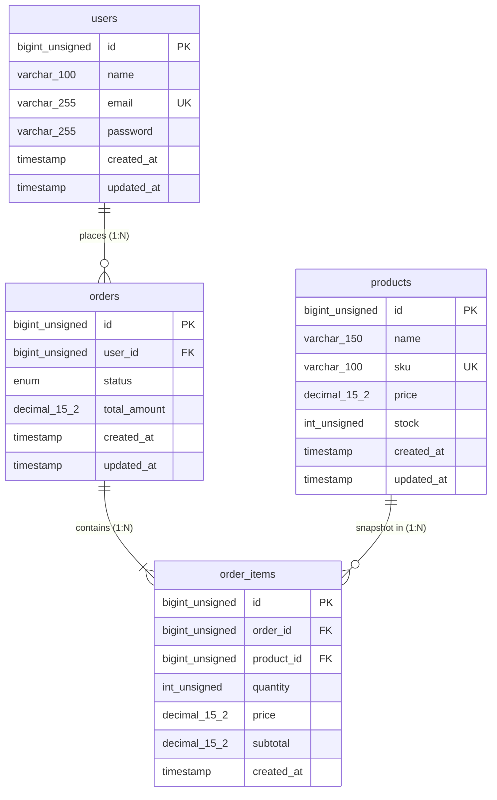

# Data Model & Database Architecture Specification

## 1. Entity-Relationship Diagram (ERD)

---

## 2. Table Schemas Specification

### 2.1 `users` Table

Stores authenticated system accounts.

| Column | Data Type | Attributes | Nullable | Default | Description |
| :--- | :--- | :--- | :--- | :--- | :--- |
| `id` | `BIGINT UNSIGNED` | `AUTO_INCREMENT`, `PRIMARY KEY` | No | *Auto* | Unique user identifier. |
| `name` | `VARCHAR(100)` | | No | None | Full display name of the user. |
| `email` | `VARCHAR(255)` | `UNIQUE KEY` (`uq_users_email`) | No | None | Unique email address for authentication. |
| `password` | `VARCHAR(255)` | | No | None | Bcrypt hashed password string. |
| `created_at` | `TIMESTAMP` | | No | `CURRENT_TIMESTAMP` | Account creation timestamp. |
| `updated_at` | `TIMESTAMP` | `ON UPDATE CURRENT_TIMESTAMP` | No | `CURRENT_TIMESTAMP` | Account last modification timestamp. |

---

### 2.2 `products` Table

Stores catalog item definitions, prices, and stock inventory.

| Column | Data Type | Attributes | Nullable | Default | Description |
| :--- | :--- | :--- | :--- | :--- | :--- |
| `id` | `BIGINT UNSIGNED` | `AUTO_INCREMENT`, `PRIMARY KEY` | No | *Auto* | Unique product identifier. |
| `name` | `VARCHAR(150)` | | No | None | Product title / commercial name. |
| `sku` | `VARCHAR(100)` | `UNIQUE KEY` (`uq_products_sku`) | No | None | Stock Keeping Unit code. |
| `price` | `DECIMAL(15,2)` | | No | None | Current unit selling price. |
| `stock` | `INT UNSIGNED` | `CHECK (stock >= 0)` | No | `0` | Available stock inventory units. |
| `created_at` | `TIMESTAMP` | | No | `CURRENT_TIMESTAMP` | Product creation timestamp. |
| `updated_at` | `TIMESTAMP` | `ON UPDATE CURRENT_TIMESTAMP` | No | `CURRENT_TIMESTAMP` | Product last modification timestamp. |

---

### 2.3 `orders` Table

Header table recording transactional order status and totals.

| Column | Data Type | Attributes | Nullable | Default | Description |
| :--- | :--- | :--- | :--- | :--- | :--- |
| `id` | `BIGINT UNSIGNED` | `AUTO_INCREMENT`, `PRIMARY KEY` | No | *Auto* | Unique order header identifier. |
| `user_id` | `BIGINT UNSIGNED` | `FOREIGN KEY` -> `users(id)` | No | None | Foreign key linking ordering user. |
| `status` | `ENUM` | `'pending','processing','completed','cancelled'` | No | `'pending'` | Current operational order status. |
| `total_amount` | `DECIMAL(15,2)` | | No | `0.00` | Aggregated monetary total of order items. |
| `created_at` | `TIMESTAMP` | | No | `CURRENT_TIMESTAMP` | Order placement timestamp. |
| `updated_at` | `TIMESTAMP` | `ON UPDATE CURRENT_TIMESTAMP` | No | `CURRENT_TIMESTAMP` | Status change timestamp. |

#### Foreign Key Actions (`orders.user_id`):
- `ON DELETE RESTRICT`: Prevents deleting a user account if active orders exist.
- `ON UPDATE CASCADE`: Cascades user ID updates across orders automatically.

---

### 2.4 `order_items` Table

Detail table recording line items, item quantities, and snapshot prices.

| Column | Data Type | Attributes | Nullable | Default | Description |
| :--- | :--- | :--- | :--- | :--- | :--- |
| `id` | `BIGINT UNSIGNED` | `AUTO_INCREMENT`, `PRIMARY KEY` | No | *Auto* | Unique line item identifier. |
| `order_id` | `BIGINT UNSIGNED` | `FOREIGN KEY` -> `orders(id)` | No | None | Foreign key linking order header. |
| `product_id` | `BIGINT UNSIGNED` | `FOREIGN KEY` -> `products(id)` | No | None | Foreign key linking purchased product. |
| `quantity` | `INT UNSIGNED` | `CHECK (quantity > 0)` | No | None | Quantity of units purchased. |
| `price` | `DECIMAL(15,2)` | | No | None | Snapshot unit price at purchase time. |
| `subtotal` | `DECIMAL(15,2)` | | No | None | Computed line total (`quantity * price`). |
| `created_at` | `TIMESTAMP` | | No | `CURRENT_TIMESTAMP` | Line item creation timestamp. |

#### Foreign Key Actions & Constraints:
- `fk_order_items_order`: `ON DELETE CASCADE` (Deleting order header purges line items).
- `fk_order_items_product`: `ON DELETE RESTRICT` (Prevents deleting product if present in order items).
- `uq_order_items_order_product`: `UNIQUE KEY (order_id, product_id)` (Prevents duplicate product lines per order).

---

## 3. Database Indexing Strategy

| Index Name | Table | Columns | Type | Rationale |
| :--- | :--- | :--- | :--- | :--- |
| `PRIMARY` | `users` | `id` | Primary | Fast PK lookup. |
| `uq_users_email` | `users` | `email` | Unique | Enforces single email registration & fast login lookup. |
| `PRIMARY` | `products` | `id` | Primary | Fast PK lookup. |
| `uq_products_sku` | `products` | `sku` | Unique | Enforces SKU code uniqueness & fast SKU filter lookup. |
| `PRIMARY` | `orders` | `id` | Primary | Fast PK lookup. |
| `idx_orders_user_id` | `orders` | `user_id` | Index | Accelerates user order history queries (`WHERE user_id = ?`). |
| `idx_orders_status` | `orders` | `status` | Index | Accelerates operational filtering by order status. |
| `PRIMARY` | `order_items` | `id` | Primary | Fast PK lookup. |
| `idx_order_items_order_id` | `order_items` | `order_id` | Index | Accelerates fetching line items for an order header. |
| `idx_order_items_product_id`| `order_items` | `product_id` | Index | Accelerates product usage audit queries. |
| `uq_order_items_order_product` | `order_items` | `order_id, product_id` | Unique | Guarantees product uniqueness per order header. |
