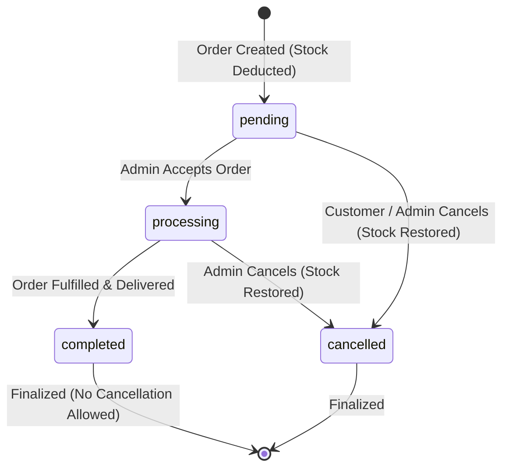

# Product Requirement Document (PRD) — Order Management REST API

## 1. Executive Summary

**Order Management REST API** is a high-performance, transactional backend web service built on Node.js (Express.js) and MySQL 8+. It provides core capabilities for e-commerce and retail platforms, including user authentication, product catalog management, transactional order processing with strict inventory validation, atomic stock deduction/restoration, and lifecycle status tracking.

The system is designed with a **Layered Architecture Pattern** (Routes -> Middlewares -> Controllers -> Services -> Repositories -> Database) to guarantee strict separation of concerns, maintainability, and horizontal scalability.

---

## 2. Product Objectives & Core Goals

1. **High Concurrency & Transactional Consistency**: Eliminate stock over-selling race conditions during peak flash-sale scenarios using MySQL InnoDB row-level locking (`SELECT ... FOR UPDATE`).
2. **Standardized API Envelope**: Deliver deterministic HTTP status codes and predictable JSON payload structures for all success and error responses.
3. **Robust Security Standards**: Enforce token-based stateless authentication (JWT), secure password hashing (bcrypt), rate limiting, and HTTP header security policies (`helmet`).
4. **Developer & AI Ready (SOT Driven)**: Maintain clear architectural guardrails allowing human backend engineers and AI coding assistants to seamlessly extend features without breaking existing domain invariants.

---

## 3. Personas & Access Control

| Persona | Description | Scope / Permissions |
| :--- | :--- | :--- |
| **Guest / Public User** | Unauthenticated user visiting the platform. | - Browse product catalog (with pagination & filter) - View public product details - Register new user account - Authenticate (Login) |
| **Authenticated Customer** | Logged-in user purchasing products. | - Access personal user profile (`/auth/me`) - Create new transactional orders - View personal order history & details - Cancel active/pending orders |
| **Store Administrator** *(Extension)* | Privileged account managing store operations. | - Create, update, or soft-delete products - Update order status (`pending` -> `processing` -> `completed`) - View system-wide analytical metrics |

---

## 4. Domain Models & Core Business Rules

### 4.1 Order Lifecycle State Machine

An order moves through strict state transitions defined by the following state diagram:

#### State Transition Matrix & Rules

| From State | To State | Trigger / Actor | Allowed? | Business Logic & Side Effects |
| :--- | :--- | :--- | :--- | :--- |
| *(None)* | `pending` | Customer `POST /orders` | Yes | Atomically locks stock, validates quantity, deducts product stock, snapshots prices, creates order & items. |
| `pending` | `processing` | Customer / Admin `PATCH /orders/:id/status` | Yes | Changes order status to `processing`. Stock remains deducted. |
| `processing` | `completed` | Customer / Admin `PATCH /orders/:id/status` | Yes | Changes order status to `completed`. Final state. |
| `pending` | `cancelled` | Customer / Admin `PATCH /orders/:id/status` | Yes | Reverts order status to `cancelled`. **Restores product stock** in atomic transaction. |
| `processing` | `cancelled` | Customer / Admin `PATCH /orders/:id/status` | Yes | Reverts order status to `cancelled`. **Restores product stock** in atomic transaction. |
| `completed` | `cancelled` | Customer / Admin `PATCH /orders/:id/status` | **NO** | **Forbidden**. Completed orders are financial ledger records and cannot be cancelled. |
| `cancelled` | *Any* | Customer / Admin `PATCH /orders/:id/status` | **NO** | **Forbidden**. Cancelled orders cannot be re-opened or modified. |

---

### 4.2 Inventory Management & Concurrency Policies

1. **Pessimistic Locking (`FOR UPDATE`)**:
   - When creating an order, product rows are locked using `SELECT ... FOR UPDATE` inside a database transaction before stock verification.
   - Prevents multi-request race conditions where two simultaneous checkouts compete for the last unit of stock.
2. **Snapshot Pricing Immutability**:
   - `order_items` stores historical `price` and `subtotal` recorded at the exact moment of transaction creation.
   - Future catalog price changes in `products.price` do NOT affect historical order totals.
3. **Order Deduplication**:
   - A single order payload cannot contain duplicate `product_id` entries. Items must be aggregated into single quantities per product before hitting the endpoint.
4. **Stock Restoration Integrity**:
   - Order cancellation triggers stock recovery for every item in `order_items`.
   - Product rows are locked during cancellation to guarantee atomic stock increments.

---

### 4.3 Security & Authentication Rules

1. **Password Hash**: All user passwords must be hashed using `bcrypt` with a minimum salt factor of `10`. Plaintext passwords must NEVER be saved or logged.
2. **JWT Lifecycle**:
   - Access tokens are signed using `HS256` algorithm with `JWT_SECRET`.
   - Expiration default: `1d` (24 hours).
   - Bearer schema format required in `Authorization` header: `Bearer <token>`.
3. **Resource Access Boundary**:
   - Customers can ONLY view and mutate orders that belong to their own `user_id`. Accessing another user's order yields HTTP `403 Forbidden`.

---

## 5. Non-Functional Requirements (NFR)

### 5.1 Performance & Scalability
- **Response Latency**: P95 response time under 150ms for read requests, under 300ms for transactional order creation under normal load.
- **Connection Pool**: MySQL connection pool with `connectionLimit: 10` (scalable via env config), `waitForConnections: true`, `queueLimit: 0`.

### 5.2 Reliability & Data Integrity
- **ACID Transactions**: Order creation and cancellation MUST execute within explicit MySQL InnoDB transactions (`connection.beginTransaction()`). Any unhandled error triggers `connection.rollback()`.
- **Database Engine**: MySQL 8.0+ using `InnoDB` engine with `utf8mb4` encoding for full unicode character support.

### 5.3 Security & Hardening
- **Rate Limiting**:
  - Global API Limiter: Max 100 requests per 15 minutes per IP (`/api/v1/*`).
  - Auth Limiter: Max 10 attempts per 15 minutes per IP (`/api/v1/auth/*`).
- **HTTP Hardening**: `helmet` header integration (XSS filter, HSTS, No-Sniff, Frameguard).
- **SQL Injection Prevention**: All queries MUST use parameterized inputs (`mysql2/promise` prepared statements with `?` placeholders).

---

## 6. Future Roadmap & Strategic Extensions

1. **Role-Based Access Control (RBAC)**: Introduce explicit `roles` column (`customer`, `admin`) in `users` table to restrict product mutation endpoints (`POST/PUT/DELETE /products`) exclusively to store administrators.
2. **Payment Gateway Integration**: Webhook triggers for Midtrans / Stripe payments, introducing payment verification before order status shifts from `pending` to `processing`.
3. **Soft Deletes**: Implement `deleted_at` timestamps on products to preserve relational audit trails for legacy items no longer available for purchase.
4. **Audit Logging & Event Streaming**: Publish order status state changes to Kafka / Redis PubSub for real-time inventory notifications.
